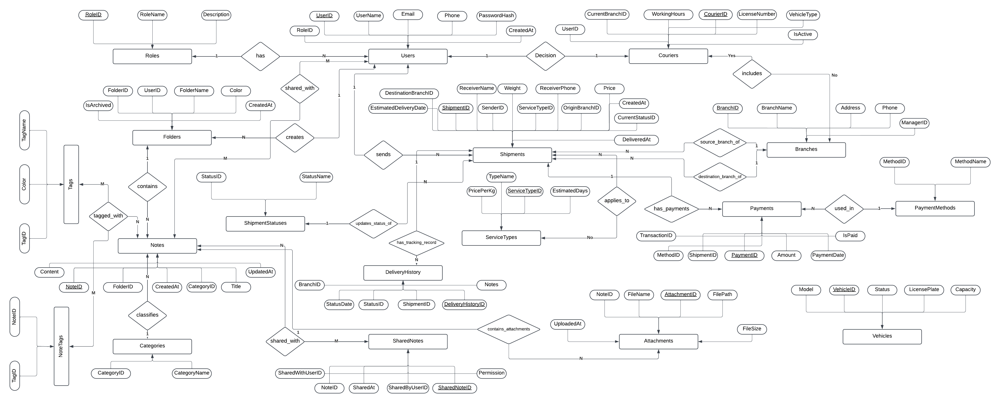
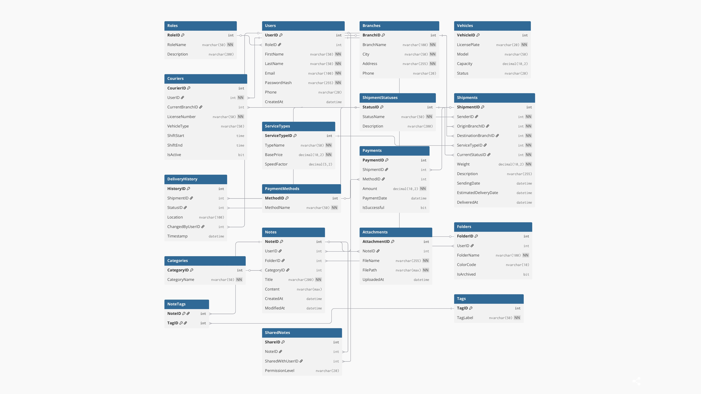
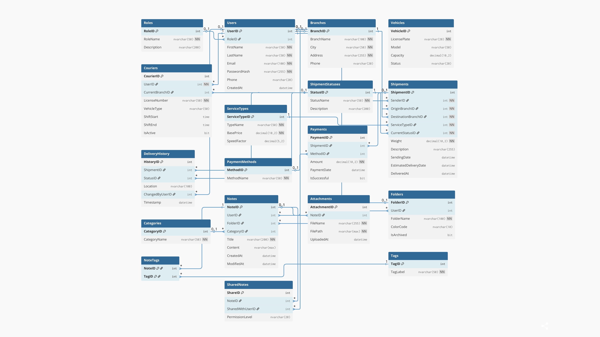

# Integrated Logistics and Note Tracking System

**Course:** Database System Design  
**Backend:** ASP.NET Core Web API  
**Database:** Microsoft SQL Server  
**Frontend:** HTML5, CSS, Bootstrap 5, JavaScript

---

## Introduction

This project is a comprehensive software solution demonstrating the principles of **Shared Kernel Architecture**. It integrates two independent domains into a single, unified platform:

1. **Logistics Management System:** Handles shipment processing, branch structure, couriers, and delivery tracking.
2. **Personal Note Management System:** Provides tools for creating and managing personal notes to improve productivity.

Both modules operate on a shared **centralized database** and **user management system** that manages authentication, authorization, and role-based access control. The project highlights database design, backend API development, and frontend integration through a modern dashboard interface.

---

## Technologies Used

### Backend and Database
- **C# / ASP.NET Core 10.0** for building RESTful APIs.
- **Microsoft SQL Server** as the relational database management system.
- **Entity Framework Core** as the Object Relational Mapper.
- **Swagger UI** for API documentation and interactive testing.

### Frontend
- **HTML5 & CSS3** for interface structure and styling.
- **Bootstrap 5** for responsive layouts and UI components.
- **Vanilla JavaScript (ES6+)** for DOM interactions and API communication through the Fetch API.

---

## Key Features

### Logistics Management Module
- Complete shipment lifecycle management (creation, updates, and delivery status tracking).
- Dynamic origin–destination branch management.
- Courier assignment and shipment routing.
- Real-time search functionality for shipments by ID or description.

### Note Management Module
- Full note CRUD functionality (Create, Read, Update, Delete).
- Notes are securely linked to individual authenticated users.

### Shared Core Features
- User authentication system (Login).
- Role-based access control for Admin, Customer, and Courier.
- Dashboard with statistics and operational summaries.

---

## Database Schema

The database **LogisticsNotesDB** contains **18 relational tables** designed following **Third Normal Form (3NF)**.

Include your ER Diagram and Logic ERD here:







---

## How to Run the Project

### 1. Database Setup
1. Open **SQL Server Management Studio (SSMS)**.
2. Load and execute the file **DatabaseScript.sql** included in the project.
3. The script will create the database `LogisticsNotesDB` and insert initial seed data.

---

### 2. Backend Configuration
1. Open the solution file **LogisticsNotesSystem.sln** in **Visual Studio**.
2. In `appsettings.json`, update the database connection string if needed:

```json
"ConnectionStrings": {
  "DefaultConnection": "Server=YOUR_SERVER_NAME;Database=LogisticsNotesDB;Trusted_Connection=True;TrustServerCertificate=True;"
}
```

3. Build the solution using **Ctrl + Shift + B**.

---

### 3. Running the Application
1. Run the API project by pressing **F5** or selecting **Run** from Visual Studio.
2. The browser will automatically open either:
   - Swagger API documentation, or  
   - The frontend dashboard.
3. Default login credentials:

```
Email: admin@sys.com
Password: 123456
```

---

## Project Structure

```bash
LogisticsNotesSystem/
│
├── LogisticsNotes.API/        # Backend API Project
│   ├── Controllers/           # API Controllers
│   ├── Models/                # Entity Classes
│   ├── wwwroot/               # Frontend Files
│   │   ├── index.html         # Dashboard Interface
│   │   ├── style.css          # Stylesheet
│   │   └── script.js          # JavaScript Logic
│   ├── Program.cs             # Application Startup
│   └── appsettings.json       # Configuration File
│
└── DatabaseScript.sql         # SQL Database Creation Script
```

---

## Author

**[Eng:Abdulrahman Hamdi]**  
Role: Fullstack Developer and AI Engineer  
Project: Database System Design Coursework  

---

© 2025 All Rights Reserved.
